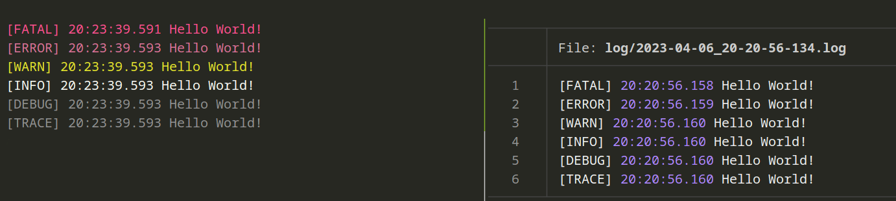

;# L200
L200 is a single-file class library that provides a simple logger for C# projects.

To use L200, add the class library to your project and then `Logger.Setup()` and `Logger.Log()` should work. A simple example is shown below:
```csharp
using L200;
public class Program
{
    public static void Main(string[] args)
    {
        // Set up the logger
        Logger.Setup(true, true, "log/", Logger.Levels.DEBUG);

        // Log some examples
        Logger.Log("Hello World!", Logger.Levels.FATAL);
        Logger.Log("Hello World!", Logger.Levels.ERROR);
        Logger.Log("Hello World!", Logger.Levels.WARN);
        Logger.Log("Hello World!", Logger.Levels.INFO);
        Logger.Log("Hello World!", Logger.Levels.DEBUG);
        Logger.Log("Hello World!", Logger.Levels.TRACE);

    }
}
```

Example of what each log level looks like:
